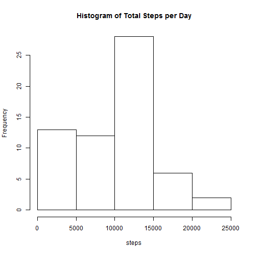
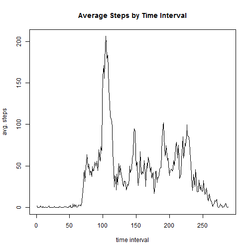

Reproducable Research: Peer Assessment #1


```r
#Loading and preprocessing the data
data<-read.csv("activity.csv")
summary(data)
```

```
##      steps                date          interval     
##  Min.   :  0.00   2012-10-01:  288   Min.   :   0.0  
##  1st Qu.:  0.00   2012-10-02:  288   1st Qu.: 588.8  
##  Median :  0.00   2012-10-03:  288   Median :1177.5  
##  Mean   : 37.38   2012-10-04:  288   Mean   :1177.5  
##  3rd Qu.: 12.00   2012-10-05:  288   3rd Qu.:1766.2  
##  Max.   :806.00   2012-10-06:  288   Max.   :2355.0  
##  NA's   :2304     (Other)   :15840
```

```r
head(data)
```

```
##   steps       date interval
## 1    NA 2012-10-01        0
## 2    NA 2012-10-01        5
## 3    NA 2012-10-01       10
## 4    NA 2012-10-01       15
## 5    NA 2012-10-01       20
## 6    NA 2012-10-01       25
```

```r
names(data)
```

```
## [1] "steps"    "date"     "interval"
```

```r
str(data)
```

```
## 'data.frame':	17568 obs. of  3 variables:
##  $ steps   : int  NA NA NA NA NA NA NA NA NA NA ...
##  $ date    : Factor w/ 61 levels "2012-10-01","2012-10-02",..: 1 1 1 1 1 1 1 1 1 1 ...
##  $ interval: int  0 5 10 15 20 25 30 35 40 45 ...
```

```r
#What is the mean total number of steps taken per day?
steps<-tapply(data$steps, data$date, sum, na.rm=TRUE)
steps<-data.frame(steps)
hist(steps$steps, xlab = "steps", main = "Histogram of Total Steps per Day")
```

 

```r
mean(steps$steps)
```

```
## [1] 9354.23
```

```r
median(steps$steps)
```

```
## [1] 10395
```

```r
#What is the average daily activity pattern?
intavg<-tapply(data$steps, data$interval, mean, na.rm = TRUE)
intavgts<-ts(intavg)
plot.ts(intavgts, xlab="time interval", ylab="avg. steps", main="Average Steps by Time Interval")
```

 

```r
#Inputting missing values
sum(is.na(data))
```

```
## [1] 2304
```

```r
newdata<-data
newdata$steps[is.na(newdata$steps)] <- 0
sum(is.na(newdata)) #should reflect 0 after N/A values have been removed
```

```
## [1] 0
```

```r
newsteps<-tapply(newdata$steps, newdata$date, sum, na.rm=TRUE)
newsteps<-data.frame(newsteps)
hist(newsteps$newsteps, xlab = "steps", main = "Histogram of Total Steps per Day")
```

 

```r
mean(newsteps$newsteps)
```

```
## [1] 9354.23
```

```r
median(newsteps$newsteps)
```

```
## [1] 10395
```

```r
#Are there differences in activity patterns between weekdays and weekends?
newdata2<-newdata
newdata2$weekday<-weekdays(as.Date(newdata2$date))
newdata2$wkndflag<-ifelse(newdata2$weekday=="Saturday"|newdata2$weekday=="Sunday", "Weekend", "Weekday")
newdata2$wkndflag<-as.factor(newdata2$wkndflag)
newdata2wknd<-subset(newdata2, newdata2$wkndflag=="Weekend")
newdata2wddy<-subset(newdata2, newdata2$wkndflag=="Weekday")

library(lattice)
attach(newdata2)
```

```
## The following object is masked _by_ .GlobalEnv:
## 
##     steps
## 
## The following objects are masked from newdata2 (pos = 4):
## 
##     date, interval, steps, weekday, wkndflag
```

```r
#xyplot(steps~interval|wkndflag)
```

